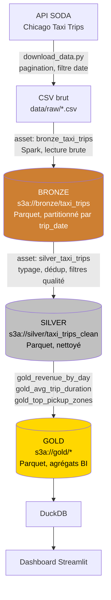
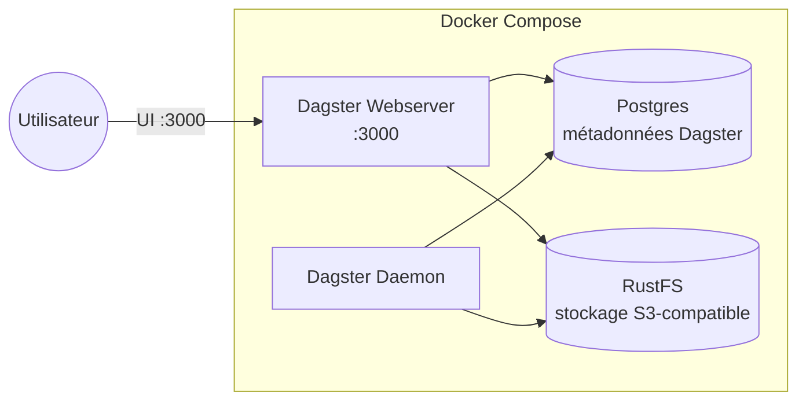

# Chicago Taxi Trips - Pipeline Data (Bronze/Silver/Gold)

Pipeline de données de bout en bout pour une entreprise de mobilité urbaine :
ingestion des trajets bruts, nettoyage, et agrégats BI (revenus/jour, durée
moyenne des trajets, top zones de prise en charge).

Ce README couvre l'architecture générale et le pas à pas pour lancer le
projet. Il renvoie, au fil des étapes, vers des documents plus détaillés
écrits en cours de route : analyses exploratoires, résultats de nettoyage,
problèmes rencontrés et résolus.

## Sommaire

- [Structure du repo](#structure-du-repo)
- [Architecture](#architecture)
- [Justification du choix de la période](#justification-du-choix-de-la-période)
- [Stack technique](#stack-technique)
- [Prérequis](#prérequis)
- [Lancement pas à pas](#lancement-pas-à-pas)
- [Choix techniques et arbitrages](#choix-techniques-et-arbitrages)
- [Ce que je ferais avec plus de temps](#ce-que-je-ferais-avec-plus-de-temps)
- [Documents complémentaires](#documents-complémentaires)

## Structure du repo

```
.
├── README.md                                  → ce document
├── docker-compose.yml                         → orchestration de l'environnement local
├── dagster_project/                           → code du pipeline (assets, resources, Dockerfile)
├── scripts/                                   → téléchargement des données brutes (API SODA)
├── data/                                       → CSV brut téléchargé (monté en volume, non versionné)
├── dashboard/                                  → app Streamlit de création du Dashboard pour  les tables gold
├── analyse_exploratoire_des_valeurs_aberrantes.md  → étude Bronze avant de définir les règles Silver
├── résultats_de_la_couche_silver.md            → contrôles, volumes conservés/rejetés en Silver
├── résultats_de_la_couche_gold.md              → résultat final des agrégats Gold
├── analyse-resultats.md                        → lecture et interprétation des résultats BI
├── PROBLEMES.md                                → incidents rencontrés pendant le build et leur résolution
└── Dashboard.pdf                            → aperçu du dashboard final
```

## Architecture

Organisation en couches medallion (bronze → silver → gold), avec le
stockage objet comme socle du datalake :



Le tout est orchestré par Dagster (assets avec dépendances explicites
bronze → silver → gold) et tourne entièrement via Docker Compose :



## Justification du choix de la période

Pour ce projet, j'ai choisi d'utiliser les données de trajets en taxi de
Chicago sur la période du 1er juillet au 13 décembre 2023.

```
01/07/2023
    ↓
Été
    ↓
Lollapalooza
    ↓
Septembre
    ↓
Chicago Marathon
08/10/2023
    ↓
Automne
    ↓
Thanksgiving
23/11/2023
    ↓
13/12/2023
Fin du dataset
```

### Pourquoi 2023 ?

L'objectif est de travailler sur une période récente et suffisamment
homogène du point de vue de la collecte et de la disponibilité des données.
Une période récente facilite aussi la comparaison avec des données externes
(météo, événements) si le projet devait être enrichi plus tard.

### Une période volontairement diversifiée

Le choix de juillet à décembre 2023 permet de couvrir plusieurs types de
situations : des journées ordinaires servant de référence, la période
estivale et son activité touristique, Lollapalooza, le Chicago Marathon,
le changement de saison à l'automne, Thanksgiving, et les déplacements de
fin d'année. L'idée est d'éviter un dataset qui ne représenterait qu'une
seule situation, et de garder à la fois des journées normales et des
journées susceptibles de provoquer des variations importantes.

## Stack technique

- **Dagster** - orchestration (assets bronze → silver → gold)
- **PySpark** (local mode) - processing
- **RustFS** - stockage objet S3-compatible, socle du datalake
- **PostgreSQL** - backend de métadonnées Dagster
- **DuckDB + Streamlit** - exposition et visualisation des tables gold
- **Docker Compose** - tout tourne en local via une seule commande

### Choix de la stratégie d'ingestion

J'ai choisi de télécharger d'abord les données depuis l'API SODA et de
conserver une copie locale du fichier brut avant de lancer le pipeline
Dagster :

```
API SODA → CSV brut → Dagster → Bronze → Silver → Gold
```

**Pourquoi télécharger avant Dagster ?** Ça garde un snapshot fixe : le
pipeline peut être relancé plusieurs fois sur exactement les mêmes données,
sans dépendre de l'API à chaque run, et ça sépare proprement l'ingestion du
traitement (plus simple à tester et déboguer).

**Pourquoi ne pas appeler l'API directement depuis Dagster ?** Ça créerait
une dépendance réseau à chaque exécution - un timeout ou un souci côté API
bloquerait tout le pipeline. Pour ce projet, le volume et la période sont
définis à l'avance, donc une copie locale est plus simple et plus
reproductible. Si les données étaient mises à jour quotidiennement en
revanche, une ingestion incrémentale directement depuis Dagster serait plus
adaptée (watermark sur `trip_start_timestamp`).

## Prérequis

- Docker + Docker Compose
- Python 3.10+ en local (uniquement pour lancer le script de téléchargement)
- ~5 Go d'espace disque disponible

## Lancement pas à pas

### 1. Télécharger une tranche de données

```bash
pip install requests
python scripts/download_data.py \
    --start 2023-07-01 --end 2023-12-31 \
    --out ./data/raw/taxi_trips_raw.csv \
    --limit 50000 --max-rows 3000000
```

La période initialement ciblée allait du 1er juillet au 31 décembre 2023.
L'extraction s'est arrêtée au 13 décembre 2023, après avoir atteint la
limite de 3 millions de lignes fixée par `--max-rows`. Filtrage sur
`trip_start_timestamp` via l'API SODA (endpoint `wrvz-psew`), récupération
par tranches de 50 000 lignes.

Snapshot réellement utilisé dans le pipeline :

| | |
|---|---|
| Date de début | 1er juillet 2023 |
| Date de fin | 13 décembre 2023 |
| Nombre de jours couverts | 166 jours |
| Nombre de trajets | 3 000 000 |

### 2. Démarrer l'environnement

```bash
docker compose up --build
```

Lance Postgres, RustFS (avec création automatique des buckets
`bronze`/`silver`/`gold`), le webserver Dagster et le daemon.

> Si tu rencontres une erreur au démarrage (build, connexion à Postgres,
> lancement de Spark), regarde d'abord [PROBLEMES.md](PROBLEMES.md) -
> j'y documente les incidents que j'ai eu pendant le développement et
> comment je les ai résolus, plusieurs sont liés à l'environnement local
> (architecture Mac Apple Silicon notamment).

### 3. Matérialiser la couche Bronze

- Ouvrir [http://localhost:3000](http://localhost:3000) (UI Dagster)
- Onglet **Assets** → sélectionner `bronze_taxi_trips` → **Materialize**

Ou en ligne de commande :

```bash
docker compose exec dagster-webserver dagster asset materialize \
    --select bronze_taxi_trips -m taxi_pipeline.definitions
```

Cette étape lit le CSV sans appliquer de règles de nettoyage et l'écrit en
Parquet partitionné par `trip_date` dans le bucket `bronze`. Avant l'écriture,
Spark ajoute cette colonne dérivée de `trip_start_timestamp`.

### 4. Analyse exploratoire avant de nettoyer

Après la matérialisation de Bronze, j'ai lancé le script
`scripts/profile_taxi_data.py` depuis le conteneur Dagster pour examiner les
données avant le nettoyage : schéma, nombre de lignes, identifiants, durées,
distances et vitesses extrêmes. Cette étape m'a permis d'identifier les
valeurs aberrantes et de guider le choix des règles Silver. Le script se lance
avec :

```bash
docker compose run --rm \
  --entrypoint python \
  dagster-webserver \
  /opt/dagster/scripts/profile_taxi_data.py
```

Les résultats de cette étude sont détaillés dans
[analyse_exploratoire_des_valeurs_aberrantes.md](analyse_exploratoire_des_valeurs_aberrantes.md).

### 5. Matérialiser la couche Silver

```bash
docker compose exec dagster-webserver dagster asset materialize \
    --select silver_taxi_trips -m taxi_pipeline.definitions
```

Typage explicite, déduplication, et application des règles de qualité
définies à l'étape précédente. Le détail des contrôles appliqués, des
volumes conservés et rejetés est dans
[résultats_de_la_couche_silver.md](résultats_de_la_couche_silver.md).

### 6. Matérialiser la couche Gold

```bash
docker compose exec dagster-webserver dagster asset materialize \
    --select "gold_revenue_by_day,gold_avg_trip_duration,gold_top_pickup_zones" \
    -m taxi_pipeline.definitions
```

Ou, pour matérialiser tout le pipeline en une seule commande une fois les
étapes précédentes validées individuellement :

```bash
docker compose exec dagster-webserver dagster asset materialize \
    --select "*" -m taxi_pipeline.definitions
```

Le résultat des trois agrégats (revenus/jour, durée moyenne, top zones) est
détaillé dans
[résultats_de_la_couche_gold.md](résultats_de_la_couche_gold.md).

### 7. Explorer les résultats

**Console RustFS** : [http://localhost:9001](http://localhost:9001)
(identifiants : `taxiadmin` / `taxiadmin-secret`) pour explorer les buckets.

**Dashboard Streamlit** :

Streamlit et ses dépendances sont déjà installés dans l'image construite à
partir de `dagster_project/requirements.txt`. Le dashboard se lance dans un
conteneur Docker, ce qui lui permet d'accéder à RustFS avec son nom de service
`rustfs` :

```bash
docker compose run --rm \
  -p 8501:8501 \
  -e S3_ENDPOINT=http://rustfs:9000 \
  -e S3_ACCESS_KEY=taxiadmin \
  -e S3_SECRET_KEY=taxiadmin-secret \
  --entrypoint streamlit \
  dagster-webserver \
  run /opt/dagster/app/dashboard/app.py \
  --server.address=0.0.0.0 \
  --server.port=8501
```

Le dashboard est ensuite accessible sur [http://localhost:8501](http://localhost:8501).

Le dashboard permet de filtrer par période, de visualiser les tendances de
revenus et de durée avec les événements clés surlignés (marathon, etc.), et
d'explorer une carte des zones les plus fréquentées et les plus rentables.
Un aperçu est disponible dans [Dashboard.pdf](Dashboard.pdf).

L'analyse et l'interprétation des résultats observés dans le dashboard sont
détaillées dans [analyse-resultats.md](analyse-resultats.md).

Le fichier `dashboard/queries.py` regroupe les fonctions qui construisent et
exécutent les requêtes SQL DuckDB utilisées par l'application pour lire les
tables Gold. Il s'agit du code d'accès aux données du dashboard, pas d'un
service ou d'une commande à lancer séparément.

**Vérification facultative avec DuckDB** : le dashboard suffit pour consulter
les résultats. Cette requête directe est utile seulement si tu veux tester
toi-même la lecture d'une table Gold depuis ton environnement local. Il faut
alors installer `duckdb` dans le venv ; DuckDB télécharge l'extension `httpfs`
au premier lancement pour accéder au stockage S3-compatible.

```python
import duckdb

con = duckdb.connect()
con.execute("INSTALL httpfs; LOAD httpfs;")
con.execute("""
    SET s3_endpoint='localhost:9000';
    SET s3_access_key_id='taxiadmin';
    SET s3_secret_access_key='taxiadmin-secret';
    SET s3_use_ssl=false;
    SET s3_url_style='path';
""")
con.sql("SELECT * FROM read_parquet('s3://gold/revenue_by_day/*.parquet') ORDER BY trip_date").show()
```

## Choix techniques et arbitrages

- **Dagster plutôt qu'Airflow** : moins de setup pour un projet local
  (webserver + daemon en une commande), et le modèle "asset" colle
  naturellement à une architecture medallion (chaque table = un asset,
  les dépendances bronze→silver→gold sont explicites).
- **Spark en mode local[*]** (un seul conteneur) plutôt qu'un cluster
  master/workers : suffisant pour le volume visé, évite une complexité
  Docker qui n'apporterait rien pour cette démo.
- **RustFS** comme stockage S3 local : permet d'écrire/lire en Parquet avec
  `s3a://`, comme en prod sur un vrai cloud object storage.
- **DuckDB** pour la couche d'exposition : lit directement les Parquet gold
  sans serveur additionnel, pratique pour la BI en local.
- **Streamlit** pour le dashboard final : rapide à mettre en place pour
  visualiser les résultats sans construire une vraie API/frontend séparés.
- Bronze et Silver sont partitionnés par `trip_date`, une colonne dérivée de
  `trip_start_timestamp` au format date. Ça évite de créer une partition
  par timestamp (des milliers de petits fichiers) et rend le
  partitionnement adapté à une lecture par journée.

## Ce que je ferais avec plus de temps

- Consacrer beaucoup plus de temps à bâtir l'architecture en amont et à
  challenger davantage le projet, pour arriver aux meilleurs choix
  techniques et aux meilleurs outils plutôt qu'aux premiers qui
  fonctionnent.
- Surveiller et ajuster la taille des fichiers Parquet si le volume
  augmente, pour éviter la création de nombreux petits fichiers par
  partition.
- Ajouter des tests de qualité de données (Great Expectations ou
  `dagster-checks`) sur les colonnes critiques (bornes de distance/durée,
  cohérence géographique).
- Gérer l'ingestion en incrémental (watermark sur `trip_start_timestamp`)
  plutôt qu'un `overwrite` complet à chaque run.
- Exposer les tables gold via une petite API FastAPI en plus de DuckDB.
- Ajouter des schedules/sensors Dagster pour automatiser le
  rafraîchissement.
- CI (lint + tests unitaires sur les transformations Spark avec des
  DataFrames de test).

## Documents complémentaires

| Document | Contenu |
|---|---|
| [analyse_exploratoire_des_valeurs_aberrantes.md](analyse_exploratoire_des_valeurs_aberrantes.md) | Étude des données Bronze en amont, pour définir les règles de nettoyage Silver |
| [résultats_de_la_couche_silver.md](résultats_de_la_couche_silver.md) | Contrôles appliqués, volumes conservés/rejetés après nettoyage |
| [résultats_de_la_couche_gold.md](résultats_de_la_couche_gold.md) | Résultat des trois agrégats BI (revenus, durée, zones) |
| [analyse-resultats.md](analyse-resultats.md) | Lecture et interprétation des résultats visibles dans le dashboard |
| [PROBLEMES.md](PROBLEMES.md) | Incidents rencontrés pendant le développement et leur résolution |
| [Visualisation.pdf](Visualisation.pdf) | Aperçu visuel du dashboard final |
